# How to run ? 


```text
PS G:\teappdump> python.exe .\predict_elo.py ./tea/organized/users/00ea9964-a415-44be-bd74-fdd55034efc3.jpg
Loading embedding model : hf-hub:timm/PE-Core-bigG-14-448...

Predicting for: ./tea/organized/users/00ea9964-a415-44be-bd74-fdd55034efc3.jpg

---------------------------------
   ELO Score predicted : 368.82
---------------------------------
PS G:\teappdump> python.exe .\predict_elo.py ./tea/organized/users/ffeda274-4646-4906-bef4-805ce29904d9.jpg
Loading embedding model : hf-hub:timm/PE-Core-bigG-14-448...

Predicting for: ./tea/organized/users/ffeda274-4646-4906-bef4-805ce29904d9.jpg

---------------------------------
   ELO Score predicted : 637.13
---------------------------------
```

First image is goblino de las americas

Second image is less goblino

For obvious reason I can't release image, all you need to know is that it's trained on embeddings on those images, with extra score elo score based on teaspill.fun votes.


------------

Dataset bias : it is what it is

Dataset source : the db dump (with images) + asked the guy owning teaspill.fun the votes DB


Dataset elo score distribution 


Val results  : 


Training metrics : 


Dataset bias : it is what it is

Dataset source : the db dump (with images) + asked the guy owning teaspill.fun the votes DB

---

## Fonctionnement

Le modèle ne regarde pas l'image directement pendant l'entraînement. À la place, on pré-traite d'abord toutes les images en **"embeddings"** (un vecteur de 1280 chiffres) en utilisant un modèle de vision pré-entraîné très puissant (`PE-Core-bigG-14-448`).

Ensuite, un modèle beaucoup plus petit et rapide (le **"Régresseur"**) est entraîné pour prédire le score ELO uniquement à partir de cet embedding.

```mermaid
graph TD
    A["🖼️<br>Input Image<br>(face.jpg)"] --> B["Step 1: Embedding Model<br>PE-Core-bigG-14-448"]
    B --> C["📊<br>Embedding Vector<br>[0.1, 0.9, ..., 0.4]<br>(Dimension: 1280)"]
    C --> D["Step 2: Regressor<br>EmbeddingRegressor MLP"]
    D --> E["📈<br>Predicted ELO Score<br>(e.g., 1450.7)"]

```


