Dataset bias : it is what it is

Dataset source : the db dump (with images) + asked the guy owning teaspill.fun the votes DB

Dataset elo score distribution 

Val results  : 

Training metrics : 

Dataset bias : it is what it is

Dataset source : the db dump (with images) + asked the guy owning teaspill.fun the votes DB

---

## Fonctionnement

Le modèle ne regarde pas l'image directement pendant l'entraînement. À la place, on pré-traite d'abord toutes les images en **"embeddings"** (un vecteur de 1280 chiffres) en utilisant un modèle de vision pré-entraîné très puissant (`PE-Core-bigG-14-448`).

Ensuite, un modèle beaucoup plus petit et rapide (le **"Régresseur"**) est entraîné pour prédire le score ELO uniquement à partir de cet embedding.

```mermaid
graph TD
    A["🖼️<br>Input Image<br>(face.jpg)"] --> B["Step 1: Embedding Model<br>PE-Core-bigG-14-448"]
    B --> C["📊<br>Embedding Vector<br>[0.1, 0.9, ..., 0.4]<br>(Dimension: 1280)"]
    C --> D["Step 2: Regressor<br>EmbeddingRegressor MLP"]
    D --> E["📈<br>Predicted ELO Score<br>(e.g., 1450.7)"]

```

